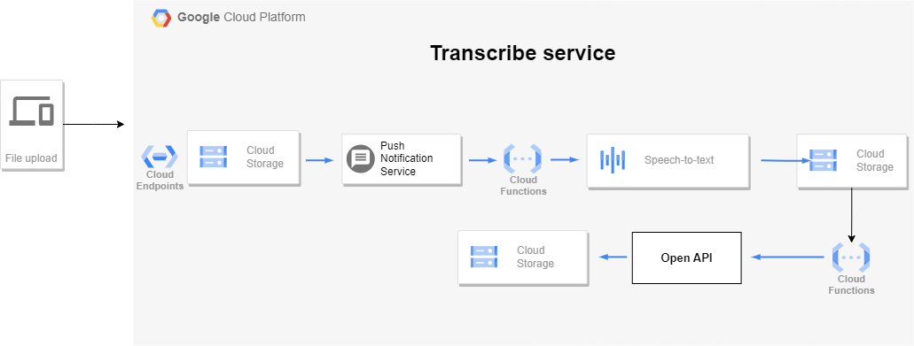

# google-devfest2023  Santo Domingo

## Introduccion

This project represents my attempt to create a serverless summary generator application, leveraging GCP as the cloud provider for the Google DevFest Santo Domingo 2023 event. The primary goal of this project is to gain practical experience in working with GCP cloud services, the Speech-to-Text API, and OpenAI models 

## Project Scope: 

## List of services GCP services used:  

- Cloud Storage
- push Notification service
- Cloud Functions 
- Speech-to-text 
- IAM & Admin 
- API Gateway 

## Services

1. transcribe service  

2. newsletter subcription service 

3. Newsletter dispatch 

 